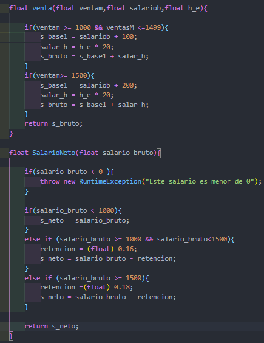

## Software con unit 4

Este ejercicio trata de resolver un ejercicio donde este trata de salario de un vendedor  
o encargado en caso que nosea asi de ninguno .

Primero que todo podemos ver que declaramos las variables global la que vamos a  necesitar, posteriormente la función general que nos facilita el ejercicio que es de  tipo float, dentro de la función hacemos lo que es validaciones en decir que tipo   de empleado es, si es vendedor o encargado y con su tipo de salario base es decir   lo que gana por contrato.

Luego lo que hicimos fue la creación de dos funciones más ya que son necesarias  la primera es porque se necesita saber las ventas mensuales para poder sumar recompensa   al empleado por conseguir mayores venta y lo que hacemos es una validación   si venta es mayor o igual a 1000 o ventas es menor o igual 1500 pues que se le suba   un aumento que es de $100 mas $20 de hora exra si es de tipo vendedor pero si es   de encargado sera de $200 mas $20 de horas extras.

En la segunda funcion es para el salario ya que necesitamos   sacar el salario bruto, esto se saca de esta manera si el salario bruto es menor   a 0 peso decimos que este salario es menor y obviamente no existe, si no calculamos   el salario teniendo en cuenta que el salario base es de 1000$ si es de tipo   vendedor pero si es de tipo encargado es de 1500$ incluyendo las retenciones   y asi podemos decir que el salario neto es el salario bruto menos las retenciones 

